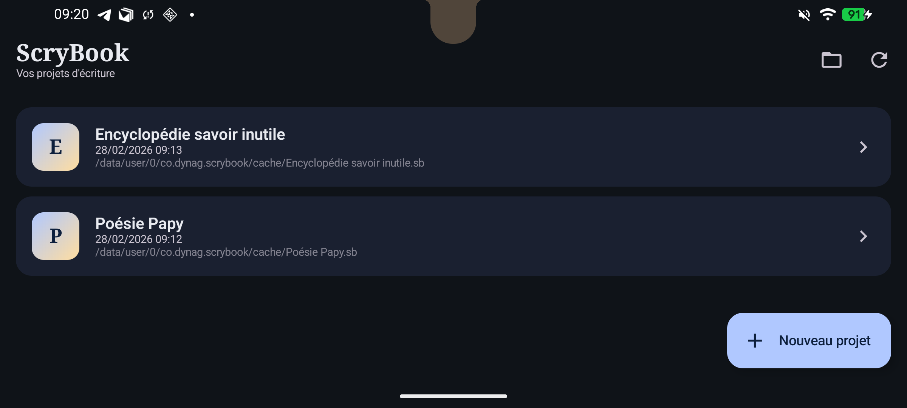
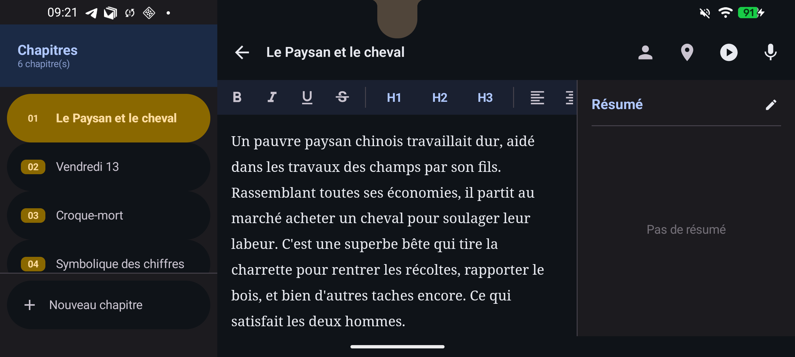
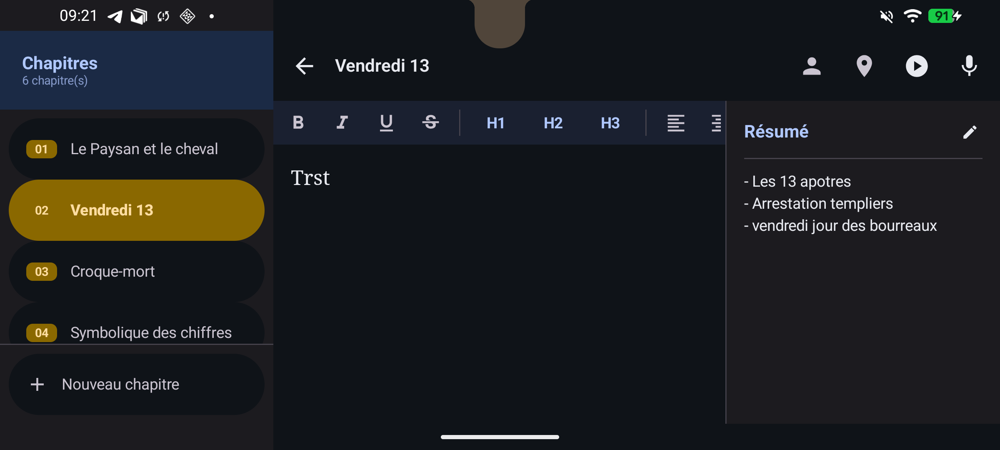

# ScryBook ✍️

**ScryBook** est une application Android moderne et épurée conçue pour les écrivains et les auteurs qui souhaitent transporter leurs manuscrits partout avec eux. 

Que vous soyez en train de rédiger votre premier roman ou de peaufiner une œuvre complexe, ScryBook vous offre une interface sans distraction avec tous les outils nécessaires à la gestion de votre projet littéraire.

## 📱 Aperçu de l'interface

<p align="center">
  
  
</p>
<p align="center">
  
</p>

## 🌟 Fonctionnalités Clés

- **Éditeur Riche (WYSIWYG)** : Une interface d'écriture fluide avec support du gras, italique, titres (H1-H3), listes et insertion d'images.
- **Sauvegarde Automatique Intelligente** : Ne perdez jamais un mot. L'app sauvegarde toutes les 30 secondes, lors des changements de chapitres ou quand vous quittez l'application.
- **Gestion de Projet Complète** : Organisez votre livre en chapitres, créez des fiches détaillées pour vos personnages et documentez vos lieux.
- **Compatibilité Desktop** : ScryBook utilise le format `.sb` (base de données SQLite), assurant une compatibilité totale avec la version bureau de l'application.
- **Export PDF** : Générez un manuscrit propre au format PDF directement depuis votre téléphone ou tablette.
- **Interface Adaptive** : Optimisé pour les téléphones et les tablettes (affichage permanent du menu et du résumé en mode paysage sur écrans larges).
- **Accessibilité** : Synthèse vocale (TTS) pour écouter vos écrits et reconnaissance vocale pour la dictée.

## 🛠️ Stack Technique

- **Langage** : Kotlin
- **Interface** : Jetpack Compose (Material Design 3)
- **Stockage** : SQLite (compatible format `.sb`)
- **Injection de dépendances** : Hilt
- **Asynchronisme** : Coroutines & Flow
- **Édition** : WebView hybride avec interface JavaScript bidirectionnelle

## 🚀 Installation & Développement

### Prérequis
- Android Studio Ladybug ou plus récent
- SDK Android API 35 (minimum 26)
- JDK 17

### Compilation
Pour compiler et installer l'APK de debug sur votre appareil :
```bash
./gradlew installDebug
```

Pour générer un bundle de release (AAB) :
```bash
./gradlew bundleRelease
```

## 📂 Structure du Projet

- `app/src/main/java/co/dynag/scrybook/data` : Couche de données (SQLite, Modèles, Référentiels).
- `app/src/main/java/co/dynag/scrybook/ui/screens` : Écrans Compose (Home, Project, Editor, etc.).
- `app/src/main/java/co/dynag/scrybook/ui/viewmodel` : Logique métier et gestion d'état.
- `.github/workflows` : Pipeline CI/CD pour GitHub et le Play Store.

## 📄 Licence

Ce projet est la propriété de **Dynag**. Tous droits réservés.

---
*Fait avec ❤️ pour les amoureux des mots.*
